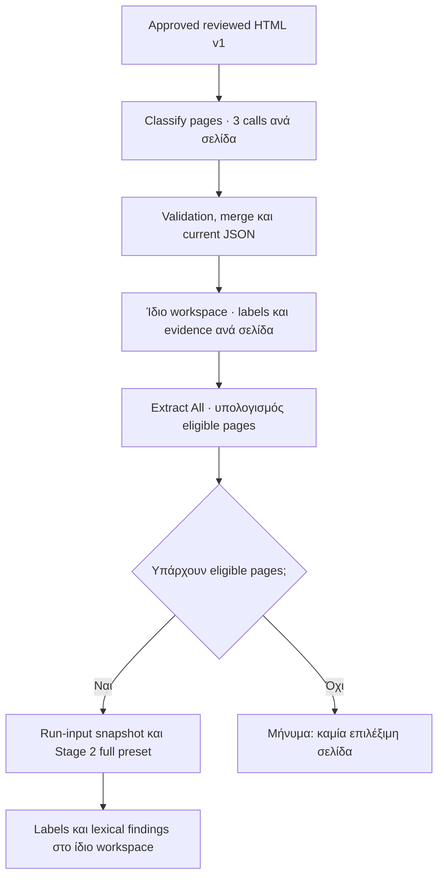

# Stage 4 — Revised End-to-End Implementation Plan

Το Stage 4 θα υλοποιηθεί ως μικρή επέκταση του υπάρχοντος local workspace: ένας classifier worker, ένα current classification ανά approved HTML identity και μία προαιρετική programmatic page restriction στο Stage 2.

Δεν προστίθενται κοινή execution υποδομή, cross-process locking, γενική ουρά, classifier history ή νέα approval διαδικασία.

## 1. End-to-end flow

Το source HTML και οι υπάρχουσες ταυτότητες document/revision/page παραμένουν αμετάβλητα.

Η κανονική ροή είναι σειριακή: classification → ολοκλήρωση της τοπικής εργασίας → Extract All. Όσο εκτελείται classification ή lexical extraction, η αντίστοιχη αντικρουόμενη ενέργεια απενεργοποιείται. Ένας μικρός server-side έλεγχος αποτρέπει διπλή ή ταυτόχρονη υποβολή μέσω refresh, δεύτερου tab ή απευθείας request.

Το υποστηριζόμενο λειτουργικό όριο είναι **ένα local harness process ανά data directory**. Δεν προστίθεται μηχανισμός συντονισμού πολλών διεργασιών.

## 2. Ακριβή λειτουργικά συμβόλαια

### 2.1 Τρεις κλήσεις και συγχώνευση

Κάθε σελίδα αποστέλλεται ολόκληρη και ανεξάρτητα στις τρεις κλειδωμένες κλήσεις:

| Κλήση | Prompt | Model |
|---|---|---|
| 1 — 2 labels | `01-materials-equipment.txt` | `MaterialEquipmentResponse` |
| 2 — 19 labels | `02-process-operations-controls.txt` | `ProcessOperationsResponse` |
| 3 — 19 labels | `03-document-supporting-records.txt` | `DocumentSupportingResponse` |

Δεν παρέχονται προηγούμενες σελίδες ή αποτελέσματα άλλων κλήσεων. Χρησιμοποιείται αποκλειστικά το υπάρχον `AsyncOpenAIWrapper.generate_structured(...)`, με τα υπάρχοντα configured model, timeout, retries και default temperature.

Η μοναδική εγκεκριμένη αλλαγή του classifier package είναι:

- `quote`: **1–240 χαρακτήρες**.
- `reason`: παραμένει **1–240 χαρακτήρες**.
- Το όριο συγχρονίζεται σε prompts, Pydantic model, generated schemas, package documentation και tests. Δεν γίνεται configuration.

Οι κανόνες merge παραμένουν:

| Συνθήκη | Αποτέλεσμα |
|---|---|
| Missing, failed ή structurally invalid call | Incomplete classification· διατήρηση των άλλων έγκυρων labels/evidence ως provisional. |
| Οποιοδήποτε `needs_review` | Διατήρηση labels/evidence και review requirement. |
| Τρία `empty` | Empty αποτέλεσμα, χωρίς fallback. |
| Διαφωνία `empty` / `ok` | Review requirement, χωρίς fallback. |
| Τρία `ok`, μη κενή ένωση | Ολοκληρωμένη ταξινόμηση με την ένωση labels. |
| Τρία `ok`, κενή ένωση | Application-generated `OTHER_UNCLASSIFIED`, χωρίς κατασκευασμένο evidence. |

Η σειρά παραμένει call 1 → 2 → 3 και η καθορισμένη σειρά κάθε prompt. Δεν υπάρχει voting ή τέταρτη κλήση.

### 2.2 Αυτόματο source-aware evidence validation

Μετά το Pydantic validation, για κάθε evidence item:

1. Ελέγχεται ότι το quote υπάρχει στο αναγνώσιμο περιεχόμενο της συγκεκριμένης page input.
2. Η κανονικοποίηση περιορίζεται σε HTML-entity decoding και whitespace collapsing, με συνεπή χειρισμό line breaks και γειτονικών table cells.
3. Αν το `element_id` δεν είναι null, πρέπει να υπάρχει στη συγκεκριμένη σελίδα και το quote να βρίσκεται στο αναγνώσιμο περιεχόμενό του.
4. Δεν χρησιμοποιούνται fuzzy matching, case folding, OCR correction, μετάφραση ή επινοημένα IDs.
5. Scripts, styles και comments δεν χρησιμοποιούνται ως evidence. Δεν συνενώνονται απομακρυσμένα χωρία για να κατασκευαστεί αντιστοίχιση.

**Έγκυρη δομή αλλά αποτυχημένη αντιστοίχιση πηγής:** διατηρούνται τα επιστραφέντα labels/evidence, επισημαίνεται το μη επαληθευμένο evidence και η σελίδα γίνεται `needs_review`.

**Απόν ή structurally invalid evidence:** η κλήση είναι invalid και η σελίδα incomplete, με εμφανή αιτία. Δεν επισκευάζεται σιωπηρά η απόκριση.

Και στις δύο περιπτώσεις η σελίδα παραμένει επιλέξιμη για extraction. Η αντιστοίχιση quote δεν παρουσιάζεται ως απόδειξη σημασιολογικής ορθότητας του label.

### 2.3 Συντηρητική πολιτική exclusion

Αποκλεισμός γίνεται μόνο όταν:

- Και οι τρεις κλήσεις υπάρχουν και είναι structurally valid.
- Δεν υπάρχει failure, incomplete κατάσταση, conflict, `needs_review` ή source-evidence validation failure.
- Η τελική λίστα labels δεν είναι κενή.
- Όλα τα labels ανήκουν στην κλειδωμένη ενότητα **Exclusions**.

Το σύνολο είναι:

`NON_RELATED`, `COVER_PAGE`, `TABLE_OF_CONTENTS`, `DOCUMENTATION_INSTRUCTIONS`, `REFERENCE_DOCUMENTATION`, `SIGNATURE_LOG`, `SIGNATURE_APPROVAL`, `ACKNOWLEDGEMENT`, `BATCH_REVIEW_DISPOSITION`, `DOCUMENT_CHANGE_HISTORY`.

Mixed-label σελίδες, empty αποτελέσματα, `OTHER_UNCLASSIFIED` και αβέβαιες/ανεπιτυχείς ταξινομήσεις παραμένουν eligible. Η πολιτική εφαρμόζεται μετά το classification και δεν τροποποιεί τα prompts.

## 3. Εργασίες υλοποίησης

### S4.1 — Classifier package και καθαροί κανόνες σελίδας

**Σκοπός και παραδοτέα**

Ενσωμάτωση του package, συγχρονισμένη διόρθωση quote limit, πλήρες page input, source validation, merge και eligibility ως μικρές ανεξάρτητα ελέγξιμες λειτουργίες.

**Εξαρτήσεις:** καμία.

**Αρχεία**

Νέα περιοχή `src/app/page_classification/`:

- `page_classification_schemas.py`
- `prompts/`, `json_schemas/`, `export_schemas.py`
- Τα παραδομένα package README/contract documents.
- `contracts.py`: application-owned call/page/current-result structures.
- `page_input.py`: ανάκτηση πλήρους σελίδας και αναγνώσιμου κειμένου/IDs.
- `rules.py`: evidence validation, merge και κλειδωμένη eligibility policy.

Tests:

- `tests/page_classification/test_page_classification_schemas.py`
- `tests/page_classification/test_page_input.py`
- `tests/page_classification/test_rules.py`

**Input → output**

Validated reviewed HTML και υπάρχουσα page identity → πλήρες page HTML.

Τρεις call outcomes και page HTML → per-call validation results, merged labels/evidence, completeness/status/reasons και eligible/excluded decision.

Το classifier input λαμβάνεται από το approved source HTML, όχι από lexical blocks ή HTML με review highlights. Δεν περικόπτονται σελίδες.

**Automated tests**

- Όρια quote 240/241 και συμφωνία prompts/models/generated schemas.
- Κλειδωμένα enums, order, evidence alignment και οι αρχικοί contract tests.
- Πλήρη page inputs, Unicode, entities, whitespace και table rows.
- Null, ανύπαρκτα ή αμφίσημα IDs και quote εκτός του δηλωμένου στοιχείου.
- Όλοι οι merge/fallback συνδυασμοί.
- Exclusion-only, mixed-label, incomplete και source-validation failure περιπτώσεις.

**Manual acceptance**

Έλεγχος labels/evidence και των περιπτώσεων exclusion στο τελικό workspace, όπως περιγράφεται στα M2–M4 παρακάτω.

**Acceptance / Definition of Done**

Οι κλειδωμένοι κανόνες εφαρμόζονται χωρίς silent repair ή label loss. Η μόνη αλλαγή του παραδομένου classifier contract είναι το quote limit.

---

### S4.2 — Μικρός classifier worker και current-state persistence

**Σκοπός και παραδοτέα**

Εκτέλεση classification για όλες τις σελίδες, αποθήκευση προόδου και αποτελεσμάτων, επαναφόρτωση μετά από reload/restart.

**Εξαρτήσεις:** S4.1.

**Αρχεία**

- `src/app/page_classification/runner.py`
- `src/app/page_classification/store.py`
- `src/app/page_classification/service.py`
- `tests/page_classification/test_runner.py`
- `tests/page_classification/test_store.py`
- `tests/page_classification/test_service.py`

Επαναχρησιμοποίηση των `app.llm`, `settings.py` και `ApprovedDocumentsRegistry`, χωρίς αλλαγή τους.

**Input → output**

Επιλεγμένο approved document και configured wrapper → ένα current classification envelope με:

- Source provenance και HTML-byte SHA-256.
- Τρέχον processing status, progress και timestamps.
- Τρεις call outcomes ανά σελίδα, χωρίς ιστορικό προσπαθειών.
- Valid/provisional labels και evidence.
- Source-validation και merge state.
- Eligibility decision/reason ανά σελίδα.
- Application origin για το fallback.
- Model και σταθερή έκδοση classifier contract/policy.

Προτεινόμενη θέση:

`<data-dir>/page-classifications/<approved-html-key>/current-classification.json`

Το key είναι filesystem-safe παράγωγο της υπάρχουσας approved HTML identity· δεν αποτελεί νέα page identity.

**Μικρός μηχανισμός εκτέλεσης**

- Ένας classifier background worker στο local service.
- Μία σελίδα κάθε φορά, με τις τρεις ανεξάρτητες async calls της σελίδας.
- Κάθε call failure καταγράφεται χωρίς να ακυρώνει τις υπόλοιπες κλήσεις.
- Atomic replacement του current JSON μετά από διαθέσιμα outcomes.
- Πρόοδος σε σελίδες και logical calls· τα εσωτερικά wrapper retries δεν εμφανίζονται ως νέες classifier calls.
- Νέα classification εκτέλεση αντικαθιστά το current αποτέλεσμα, χωρίς ανάμειξη παλιών και νέων page outcomes.

**Reload/restart**

- Reload διαβάζει την τρέχουσα αποθηκευμένη εργασία και δεν υποβάλλει νέα.
- Restart μετατρέπει εγκαταλελειμμένο in-progress classifier state σε `interrupted`.
- Όσα outcomes έχουν αποθηκευτεί διατηρούνται. Ανεπεξέργαστες ή μη ολοκληρωμένες σελίδες παραμένουν incomplete και eligible.
- Δεν γίνεται automatic resume ή αυτόματη νέα API κλήση.
- Persistence failure δεν παρουσιάζεται ως completed εργασία.
- Αλλαγμένο HTML hash/provenance απορρίπτεται ως διαφορετικό input.

**Automated tests**

Σωστή χρήση prompt/schema και settings, partial call failure, atomic-write failure, progress counters, reload χωρίς νέα calls, restart mid-page, replacement του current result και προστασία από διπλή classifier submission.

**Manual acceptance**

M1, M2 και M7: πραγματική classification, refresh και restart με έλεγχο persisted state.

**Acceptance / Definition of Done**

Η εφαρμογή παρουσιάζει όσα πραγματικά αποθηκεύτηκαν, χωρίς history, retry ledger, shared executor ή cross-process ownership layer.

---

### S4.3 — Extract All, run-input snapshot και στενό Stage 2 allow-list

**Σκοπός και παραδοτέα**

Μεταφορά των eligible page numbers στο υπάρχον Stage 2 `full` execution και διατήρηση του classification context που χρησιμοποιήθηκε.

**Εξαρτήσεις:** S4.1–S4.2.

**Αρχεία**

Στοχευμένες αλλαγές:

- `src/app/extraction_review/local_jobs.py`
- `src/app/page_classification/service.py`, `store.py`
- `src/app/lexical_extraction/runner.py`
- `src/app/lexical_extraction/dictionary_matcher.py`, μόνο στο reviewed-HTML replay/filter boundary.
- `src/app/lexical_extraction/contracts.py`
- `src/app/lexical_extraction/publication.py`

Focused tests:

- `tests/extraction_review/test_local_jobs.py`
- `tests/lexical_extraction/test_runner.py`
- `tests/lexical_extraction/test_dictionary_matcher.py`
- `tests/lexical_extraction/test_contracts.py`
- `tests/lexical_extraction/test_publication.py`
- `tests/page_classification/test_service.py`

Δεν προστίθεται YAML option ή page-selection module/framework.

**Input → output**

Το **Extract All** υπολογίζει server-side το eligible page allow-list και αντιστοιχεί πάντα στο υπάρχον `full` preset.

Πριν από submission:

1. Επαληθεύεται η ίδια approved HTML identity.
2. Αντιγράφεται το classification context που χρησιμοποιείται.
3. Καταγράφονται το digest του snapshot και η policy version.
4. Υποβάλλεται το υπάρχον local lexical job.

Προτεινόμενη θέση snapshot, δίπλα στα υπάρχοντα job δεδομένα:

`<data-dir>/extraction-jobs/<local_job_id>/classification.json`

Το job κρατά αναφορά και digest. Μεταγενέστερη επαναταξινόμηση δεν αλλάζει αυτό το αντίγραφο. Δεν δημιουργείται classifier version browser ή γενικό history store.

Για interrupted/failed classification processing, μπορεί να χρησιμοποιηθεί το διαθέσιμο terminal checkpoint: οι ανεπίλυτες σελίδες παραμένουν eligible και το snapshot διατηρεί την πραγματική κατάσταση. Δεν παρουσιάζεται ως επιτυχής classification.

**Stage 2 boundary**

Προστίθεται μικρή προαιρετική programmatic παράμετρος `allowed_page_numbers`, μαζί με τα αναγκαία classification provenance στοιχεία.

- Όταν απουσιάζει, εκτελείται η ακριβώς υπάρχουσα διαδρομή.
- Όταν υπάρχει, τα eligible blocks επιλέγονται πριν από dictionary και unit/value matching.
- Ο reader εξακολουθεί να επαληθεύει τα αρχικά HTML bytes και το hash.
- Page numbers, order, node IDs και spans δεν αλλάζουν.
- Στα artifacts εκπέμπονται μόνο οι επιλεγμένες σελίδες, με την κανονική υφιστάμενη σημασιολογία τους.
- Δεν εκπέμπονται synthetic excluded-page records ή νέο `not_covered` μοντέλο.
- Άγνωστα/μη έγκυρα page numbers ή provenance mismatch απορρίπτονται· δεν οδηγούν σε σιωπηρή unrestricted εκτέλεση.

Στο lexical provenance/manifest καταγράφονται:

- Selected page numbers.
- Classification policy/version.
- Classification snapshot digest.

Αυτά εξηγούν τη μείωση του scan scope χωρίς να αλλάζουν το HTML hash ή τους matching rules. Όταν restriction απουσιάζει, τα νέα optional στοιχεία δεν προστίθενται στο legacy serialized output και δεν αλλάζει το υπάρχον configuration digest.

**Μηδέν eligible pages**

Δεν υποβάλλεται Stage 2 job και δεν παράγεται empty publication.

Το workspace εμφανίζει:

> No pages are eligible for lexical extraction under the classification policy.

Η κατάσταση αυτή δεν είναι extraction failure, ούτε δημιουργεί extraction result για approval.

**Automated tests**

- Excluded pages δεν συμμετέχουν σε κανένα matching component.
- Mixed-label page παραμένει στο allow-list.
- Source bytes/hash και spans αμετάβλητα.
- Manifest/provenance περιέχουν την πραγματική restriction.
- No-restriction regressions και ανάγνωση παλαιών jobs.
- Zero eligible pages → καμία Stage 2 invocation.
- Snapshot isolation μετά από νέα classification.

**Manual acceptance**

M4–M6 και M8.

**Acceptance / Definition of Done**

Το restriction εφαρμόζεται πριν από το matching, το `full` preset παραμένει το υπάρχον και κάθε lexical run διατηρεί το σωστό classification context.

---

### S4.4 — Στενή επέκταση local API, harness και υπάρχοντος workspace

**Σκοπός και παραδοτέα**

Προσθήκη της νέας ροής στην ίδια οθόνη, πριν και μετά το lexical extraction.

**Εξαρτήσεις:** S4.2–S4.3.

**Αρχεία**

- `src/app/api/extraction_reviews.py`
- `src/app/extraction_review/workspace.py`
- `src/app/page_classification/service.py`
- `tests/extraction_review/local_harness.py`
- `frontend/src/extractionReview.ts`
- `frontend/src/components/ExtractionReviewWorkspace.vue`
- Προαιρετικό μικρό presentation component `PageClassificationPanel.vue`, εφόσον κρατά καθαρό το υπάρχον workspace.
- `tests/extraction_review/test_workspace.py`, `test_local_harness.py`
- `frontend/tests/extraction-review-workspace.test.ts`
- `frontend/tests/extraction-review-bundle.test.ts`

**Input → output**

Το local API αποκτά μόνο τις λειτουργίες που απαιτούνται για:

- Λίστα/επιλογή approved document.
- Ανάγνωση HTML και current classification πριν υπάρξει lexical run.
- Start classification και ανάγνωση status/progress.
- Extract All και παρακολούθηση του υπάρχοντος lexical job.
- Ανάγνωση του classification snapshot όταν ανοίγει συγκεκριμένο run.

Ο browser δεν παρέχει filesystem paths, model overrides ή δικό του allow-list. Η επιλεξιμότητα υπολογίζεται στον server.

**UI**

- Approved HTML αριστερά.
- Labels, evidence, validation/merge state και eligible/excluded ένδειξη δεξιά.
- Navigation για κάθε σελίδα, ακόμη και αν αποκλείστηκε από lexical extraction.
- **Classify pages**, status/progress και **Extract All**.
- Χωρίς νέο lexical-action selector.
- Classifier πληροφορίες αποκλειστικά read-only.
- Μετά το extraction, τα υπάρχοντα lexical findings και οι λειτουργίες τους παραμένουν διαθέσιμα.
- Το run selector εμφανίζει τα labels από το συγκεκριμένο run snapshot, όχι από το νεότερο current classification.

Όσο υπάρχει ενεργή classification ή lexical εργασία, η UI απενεργοποιεί conflicting submissions. Ο ίδιος μικρός in-process έλεγχος εφαρμόζεται και στο API, χωρίς refactor του U2 job lifecycle ή γενική ουρά.

Μετά τη λήξη/διακοπή της classification εργασίας, `needs_review`, incomplete, invalid ή conflicting page outcomes **δεν εμποδίζουν** το Extract All.

Το harness παραμένει localhost-only και μπορεί να ανοίξει αποθηκευμένα δεδομένα χωρίς OpenAI key. Νέα classification απαιτεί την υπάρχουσα έγκυρη OpenAI ρύθμιση. Production mounting δεν αλλάζει.

**Automated tests**

Pre-extraction document view, submissions/progress, disabled conflicting actions, server-side duplicate rejection, terminal incomplete→Extract All, zero-eligible message, combined display, reload, run-context isolation και προστασία από καθυστερημένες αποκρίσεις προηγούμενης επιλογής.

Παραμένουν οι υπάρχοντες έλεγχοι για Save, stale revision, Remove/Restore, TXT και approval invalidation.

**Manual acceptance**

Η πλήρης ροή M1–M8.

**Acceptance / Definition of Done**

Η λειτουργία ολοκληρώνεται μέσα στο ίδιο workspace, χωρίς νέα review scopes ή αλλαγή της σημασίας του **Approve extraction result**.

---

### S4.5 — End-to-end verification και τελική τεκμηρίωση

**Σκοπός και παραδοτέα**

Επαλήθευση της ολοκληρωμένης local λειτουργίας και καταγραφή του αποδεδειγμένου αποτελέσματος.

**Εξαρτήσεις:** S4.1–S4.4.

**Αρχεία**

- `tests/page_classification/test_end_to_end.py`
- Μικρά test fixtures/fakes στην ίδια test περιοχή.
- Ένα Stage 4 local guide με acceptance checklist.
- Αναγκαία consolidation στα `.ai/03_common_handoff.md`, `.ai/04_code_map.md`, `.ai/05_pipeline_contracts.md`.

Δεν επαναδημιουργούνται Stage 1, Stage 2 ή Stage 3 guides.

**Input → output**

Λειτουργική υλοποίηση → automated verification, recorded local manual acceptance και ενημερωμένο handoff.

**Automated tests**

End-to-end με controlled classifier responses και πραγματικό Stage 2 σε μικρό synthetic knowledge snapshot. Focused backend/frontend regressions και τα απαιτούμενα Ruff/Pyright/test/build gates.

**Manual acceptance**

Πραγματικό configured OpenAI run για τη βασική διαδρομή. Controlled test-only responses για failure/exclusion περιπτώσεις που δεν είναι αξιόπιστο να απαιτηθούν από live μοντέλο.

**Acceptance / Definition of Done**

Καταγράφεται χωριστά τι είναι implemented, test-verified και manually verified. Δεν εξάγεται από τα contract tests ισχυρισμός classification accuracy.

## 4. Ελάχιστο local manual acceptance

| Βήμα | Έλεγχος |
|---|---|
| **M1 — Πραγματική classification** | Εκκίνηση του υπάρχοντος local harness με approved document, Stage 2 configuration και τις υπάρχουσες OpenAI ρυθμίσεις. Select document → Classify pages. Παρακολούθηση πραγματικής προόδου και terminal processing state. |
| **M2 — Evidence και reload** | Επιθεώρηση quote/reason/ID έναντι HTML. Refresh διατηρεί αποτελέσματα και δεν δημιουργεί νέες API κλήσεις. |
| **M3 — Invalid/missing evidence** | Με test-only injected responses: ανύπαρκτο quote/ID → `needs_review` χωρίς label deletion· missing required evidence → invalid call/incomplete page. Extract All παραμένει διαθέσιμο μετά τη λήξη processing. |
| **M4 — Exclusion policy** | Exclusion-only page παραλείπεται· mixed-label page διατηρείται. Οι αποφάσεις και οι αιτίες παραμένουν ορατές για όλες τις σελίδες. |
| **M5 — Extract All** | Ένα click εκκινεί το υπάρχον `full` lexical preset μόνο στις eligible pages. Έλεγχος selected page numbers, policy/version και classification digest στο manifest. |
| **M6 — Combined workspace / approval** | Labels και lexical findings εμφανίζονται μαζί. Add/Edit/Remove/Restore → Save → Approve extraction result. Effective επόμενο Save καθαρίζει approval· no-op Save το διατηρεί. |
| **M7 — Restart** | Διακοπή harness κατά classification και επανεκκίνηση: εμφανίζεται `interrupted`, διατηρούνται τα checkpoints, δεν γίνονται αυτόματα νέα calls και οι ανεπίλυτες σελίδες παραμένουν eligible. |
| **M8 — Snapshot και zero eligible** | Νέα classification δεν αλλάζει labels παλιού lexical run. Σε controlled all-excluded περίπτωση εμφανίζεται το σαφές μήνυμα χωρίς νέο Stage 2 job ή extraction failure. |

Τα controlled cases χρησιμοποιούν το πραγματικό UI/backend με test-only injection. Δεν εισάγουν νέο product control, prompt variant ή wrapper.

## 5. Όριο αποδοχής και σημασίες

- **Classification outcome:** τι επέστρεψαν οι τρεις κλήσεις, αν το evidence επαληθεύτηκε και αν το αποτέλεσμα είναι complete, provisional, empty ή review-required.
- **Processing/publication outcome:** αν ολοκληρώθηκε η τοπική εργασία και, για Stage 2, ποια extraction αποτελέσματα δημοσιεύθηκαν. Completed processing δεν συνεπάγεται καθαρές classifications.
- **Final human approval:** η υπάρχουσα Stage 3 έγκριση του saved extraction result συγκεκριμένου run. Δεν εγκρίνει classifier labels και δεν δίνεται αυτόματα.

Το Stage 4 ολοκληρώνεται όταν η πραγματική local διαδρομή λειτουργεί, το allow-list καταγράφεται και εφαρμόζεται σωστά, το reload/restart είναι ειλικρινές και οι υφιστάμενες Save/approval semantics παραμένουν αμετάβλητες.

**Το αναθεωρημένο πλάνο σταματά εδώ, για review και ρητή έγκριση πριν από υλοποίηση.**